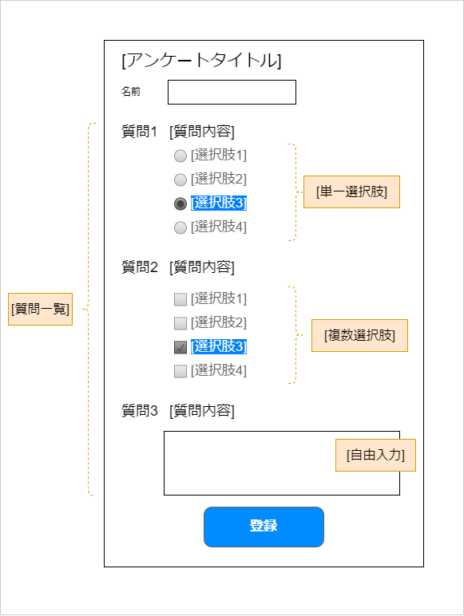

## 目的

事前に登録されたアンケートデータをもとに、回答する画面を表示し、入力内容を登録します。

各質問項目は、必須入力とします。

## 画面イメージ

## データモデル

Questionnaire: アンケートデータ

| 項目      | 和訳               | 型                                                                | 制約 | 説明                                       |
| --------- | ------------------ | ----------------------------------------------------------------- | ---- | ------------------------------------------ |
| id        | ID                 | string                                                            |      | アンケートを一意に識別するID               |
| subject   | アンケートタイトル | string                                                            | 必須 | .                                          |
| questions | 質問               | SingleChoice \| MultipleChoice \| FreeText  の配列 | 必須 | 質問のオブジェクトのいずれかのタイプの配列 |

SingleChoice: 質問項目 - 複数選択肢

| 項目    | 和訳       | 型                | 制約 | 説明                       |
| ------- | ---------- | ----------------- | ---- | -------------------------- |
| id      | ID         | string            | 必須 | 質問項目を一意に識別するID |
| content | 質問文     | string            | 必須 | .                          |
| type    | 質問タイプ | 'single'          | 必須 | .                          |
| choices | 選択肢     | ChoiceValueの配列 | 必須 | .                          |

MultipleChoice: 質問項目 - 単一選択肢

| 項目    | 和訳       | 型                | 制約 | 説明                       |
| ------- | ---------- | ----------------- | ---- | -------------------------- |
| id      | ID         | string            | 必須 | 質問項目を一意に識別するID |
| content | 質問文     | string            | 必須 | .                          |
| type    | 質問タイプ | 'multiple'        | 必須 | .                          |
| choices | 選択肢     | ChoiceValueの配列 | 必須 | .                          |

FreeText: 質問項目 - フリー記述

| 項目    | 和訳       | 型         | 制約 | 説明                       |
| ------- | ---------- | ---------- | ---- | -------------------------- |
| id      | ID         | string     | 必須 | 質問項目を一意に識別するID |
| content | 質問文     | string     | 必須 | .                          |
| type    | 質問タイプ | 'freeText' | 必須 | .                          |

ChoiceValue: 選択肢の値と表示文字列

| 項目         | 和訳       | 型     | 制約 | 説明 |
| ------------ | ---------- | ------ | ---- | ---- |
| value        | 値         | string | 必須 | .    |
| displayValue | 表示文字列 | string | 必須 | .    |

Answer: 回答データ

| 項目             | 和訳         | 型                | 制約 | 説明                   |
| ---------------- | ------------ | ----------------- | ---- | ---------------------- |
| id               | ID           | string            | 必須 | 回答を一意に識別するID |
| registrationDate | 登録日       | Date              | 必須 |                        |
| questionnaireId  | アンケートID | string            | 必須 | 対象のアンケートID     |
| answers          | 回答         | AnswerValueの配列 | 必須 | 回答内容               |

AnswerValue: 回答の値

| 項目       | 和訳     | 型                 | 制約 | 説明         |
| ---------- | -------- | ------------------ | ---- | ------------ |
| questionId | 質問     | string             | 必須 | 対象の質問ID |
| value      | 回答の値 | string \| string[] | 必須 | .            |

## 画面の項目の説明

### アンケートタイトル

`Questionnaire.subject`の値を表示します。

### 質問一覧

`Questionnaire.questions`の配列の数だけ表示します。

質問のタイプに応じた表示とします。

### 質問内容

各質問項目オブジェクトの`content`を表示します。

### 単一選択パターン

`SingleChoice`オブジェクトの`choices`の配列の数だけ表示します。

`Anser.answers[].questionId`が一致する対象の回答の値を表示、および変更を反映します。

各選択肢は、`ChoiceValue.displayValue`を表示し、選択したときのデータの値を`ChoiceValue.value`とします。

選択された項目は、Primary色の反転色で表示されます。

### 複数選択パターン

`MultipleChoice`オブジェクトの`choices`の配列の数だけ表示します。

`Anser.answers[].questionId`が一致する対象の回答の値を表示、および変更を反映します。

各選択肢は、`ChoiceValue.displayValue`を表示し、選択したときのデータの値を`ChoiceValue.value`とします。

選択された項目は、Primary色の反転色で表示されます。

### フリー記述パターン

`FreeText`オブジェクトの`content`を表示します。

### 登録ボタン

クリックすると、入力内容をチェックします。

問題がなければ、現在日時を `Answer.registrationDate`似格納して、API `/api/questionnaire/{questionnaireId}/answer`にPOSTリクエストを送信します。

問題があれば、その項目にエラーメッセージを表示します。

## URL

- アンケートを回答するページ: `/questionnaire/answer/?qid={questionnaireId}`
- アンケートを参照するページ: `/questionnaire/answer/{answerId}`
